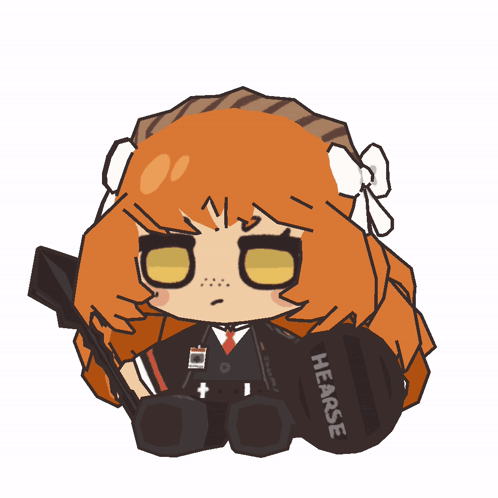

## Captain Ahab (Limbus Company)

I am the only one who matters. What matters is that I have declared this beast evil--and that is my commandment, my belief, my religion, and my creed.

When I perish, this world shall perish as well. So my very life, my very existence itself, is then the world! And I have deemed it so! No one will be the helmsman of my life but myself!!! *No one shall live my life in my stead!!!*

What do you, all of you, believe in? Tell me. Is your belief unbreakable? Is it absolute?

My beliefs are absolute! My definitions of good and evil are clear-cut! Thus my beliefs are unclouded, unassailable. Because I have made it so.

That is why I will never be broken. That is why I stand tall, unshakeable, as a missionary of my own faith.

***I have blessed you with my absolute definitions of good and evil! So that you may live your life with unhesitating, unwavering tenacity!!!***

  
